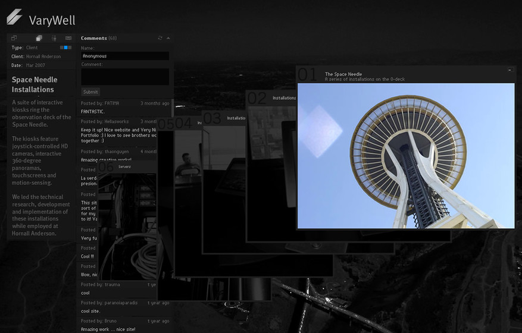

# *flash-recall*

---

本仓库包含以下迁移自 Google Code 的 Flash 项目：

|  项目  |  发布时间  | 简介  |
| :---: | :---: | :---: |
| [neatunit](neatunit/) | 2010 | 轻量、简洁易用的 ActionScript 单元测试工具
| [neatfx-multicore](neatfx-multicore/) | 2009 | 轻量、简洁易用的 Flash 应用开发框架（ 支持模块化开发 ）
| [neatfx-standard](neatfx-standard/) | 2009 | 轻量、简洁易用的 Flash 应用开发框架

---

> 原版 VaryWell 网站使用了 Flash 3D 技术，非常具有代表性 ( 图片来自 [The FWA](https://thefwa.com/cases/varywell) )

> Flash 调试工具

