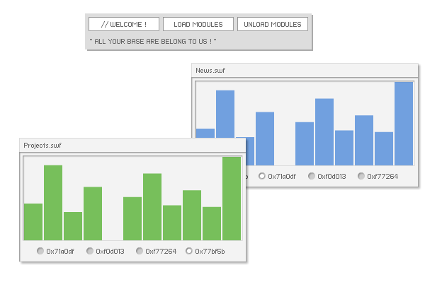

# neatfx-multicore

> 本项目已停止维护

不论孤军奋战还是团队协作，代码规范都不容忽视。语法层面可以遵循最佳编码实践配合代码审查、格式化工具，而程序结构层面的代码规范通常由引入框架来实现。

遵循框架规范有助于更好的设计程序架构、规划源代码包、创建复杂功能模块、跟踪调试错误、提高可维护性。代码时刻处于有序可控状态，你可以在不同程序部分间灵活切换编码，即使中途离开也能”随时回来“，熟悉的框架处理逻辑会帮助你尽快适应并恢复开发进度。设计先行，如果项目开始就着手完善架构设计工作，之后的编码过程会更加稳健轻松，你将始终是"处于有序代码整体之上的观察者"，而不是深陷于编码、架构设计、组织代码相互混杂的无序开发。保持有序、灵活编码、快速实现，省下时间享受生活。框架正是帮助你实现这个目标的有力工具。

大型框架的核心架构通常较为复杂，充满了大量设计模式和接口，尽管有帮助文档和最佳实践，但如果无法透彻理解驾驭框架，如何放心让它接管重要的开发工作？而且，大型框架往往功能有余而灵活性不足，在轻量基础框架之上通过整合其他适合自身实际需求的工具，同样可以获得大型框架的体验。

流行的轻量框架中，`PureMVC` 的设计非常优秀，但对于刚接触框架的开发者来说，在学习和使用上它仍然不够“平易近人”，实际上大部分框架都存在类似问题。另外，`PureMVC` 多核版本实现较为复杂，尤其是模块通信部分，实际使用比较繁琐。因此，我希望能有一个轻量（轻量化核心类库、仅提供基础框架功能）、简洁（微架构、避免过度设计、优雅实现）、易用（便于理解、上手快、少量代码即可部署）的代码组织工具来帮助我实现应用架构、功能模块划分。于是便有了这个项目。

---

* 面向 `Flash` 平台，专注基础框架功能，适用灵活，容易和其他工具整合
* 基于 `Model-View-Controller` 模式，基础 `OOP` 代码实现，无需面对复杂设计模式，轻松掌握
* 轻量化源代码，降低使用框架带来的文件体积增加，加快编译速度
* 基于自定义事件的框架通信系统（ 不依赖 `Flash` 内置事件 ），低耦合
* 自动宏命令
* 实用的事件追踪功能，可监控输出框架内部事件通信状态，便于调试代码
* 事件传递同步携带数据
* 事件响应范围可控，通信更加自由灵活
* 基于 `ID` 标识的模块化解决方案，简单易用，可有效组织代码、降低代码冲突，提高开发效率
* 创新简洁的框架通信设计。模块间通信与模块内通信使用方法一致，你需要做的仅仅是选择正确的事件类型
* 内置模块管理器，提供模块加载/卸载功能

---

示例应用位于 `demo/` 目录，编译后可生成 1 个主应用及 2 个可按需加载卸载的子模块：

---

* 下载文件中包含了 `build.xml`，可使用 `Ant` 进行编译。
* 目录结构为个人开发习惯，仅供参考。
* 本项目源代码基于 `MIT` 许可发布，作者保留框架名称及图像设计版权。
* 希望项目能够对你有所帮助。如果你喜欢，可以分享给其他人，这是理想的传播方式，也是对作者最好的支持和鼓励。
