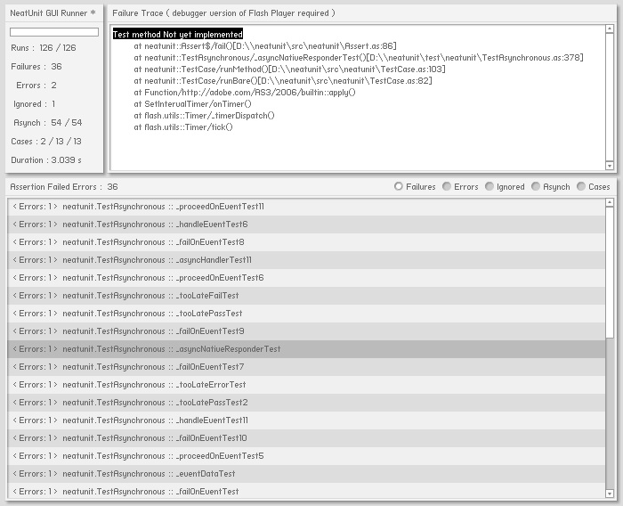

# neatunit

> 本项目已停止维护

这是一个实验性的 Flash 源代码单元测试工具，最初设计目的是为搭配个人开发的 [“neatfx”](https://github.com/neatfx/flash-neatfx) 框架使用，代码仅供参考。

* 设计简洁、代码轻量
* 包含常见基础测试方法
* 支持异步测试（ 支持并行执行多个异步测试 ）
* 包含图形界面 `TestRunner`（ 使用 `MinimalComps` 实现 ）
* 包含测试

期待它可以进化为一个真正的生产力工具，为以下情况提供备选方案：

* 单元测试入门，了解测试框架的工作原理
* 不喜欢臃肿的 `Flex` 框架，不使用 `FlashBuilder` 等大型 IDE，无法享受 `FlexUnit` 集成测试服务
* 对于始终无法深入了解的黑箱工具缺乏安全感
* 不喜欢大而全，偏好轻巧实用的工具

核心代码仅包含 8 个类，其中 `TestRunner`、`Assert`、`StringAssert`、`CollectionAssert`、`TestResult` 非常简单，剩下的 `TestCase`、`TestSuit`、`Async` 也都不复杂，读完只需一杯咖啡的时间。

---

* ~~FIXME: 同时运行多个异步测试有时会出现预期外结果，准确性方面未达到理想状态~~
* ~~TODO: 使用 `AIR` 改写 `TestRunner` 部分，节省编译时间，提高整体测试效率~~
* ~~TODO: 优化测试结果的数据结构，便于输出~~
